## Movie Square? 

- **Movie + Square**  영화 광장이라는 뜻으로 영화를 검색하고 리뷰글을 달면서 자유게시판에 즐겁게 게시글을 남기는 모습이 마치 광장에 모인 사람들과 같다고 생각해서 **Movie Square**로 짓게 되었습니다.

## 1) 팀원 정보 및 업무 분담

- 김태경  
    - **팀장**
    - 아이디어 구상 및 모델, Restful API 구성
    - Back End 개발
    - 추천 알고리즘 구현
    - 예외처리
    - 발표 자료 준비 및 발표
- 이동희
    - Front End 개발 
    - 웹디자인 작업 
    - 영화 검색 기능 및 여러 기능 구현

## 2) 목표 서비스 구현 및 실제 구현  정도

- [x] 관리자 뷰에서 권한 가지고 제어 가능

- [x] 영화 검색 후 로그인 된 유저는 영화 평점, 줄거리, 감독 등등 세부정보 확인 가능
- [x] 추천 알고리즘을 통한 검색 후 검색된 영화와 관련된 추천영화 10개 제공
- [x] 현재 상영중인 영화, 개봉중일 영화, 가장 평점이 좋은 영화 10개 제공
- [x] 게시글 CRUD가 가능한 커뮤니티 기능 구현 및 게시글 내에서 댓글 작성 수정 및 삭제 기능 구현
- [x] 작성한 글과 좋아요 한 글을 보여주는 프로필 페이지 구현

### 	모든 항목 구현 완료

## 3) 데이터베이스 모델링 (ERD) 

 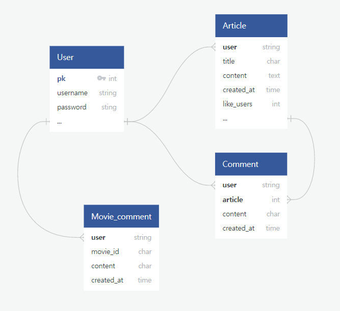

## 4) 필수 기능에 대한 설명

- [x] 관리자 뷰에서 권한 가지고 제어 가능

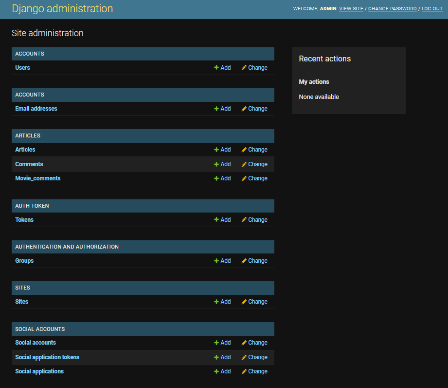

- [x] 영화 검색 후 로그인 된 유저는 영화 평점, 줄거리, 감독 등등 세부정보 확인 가능

    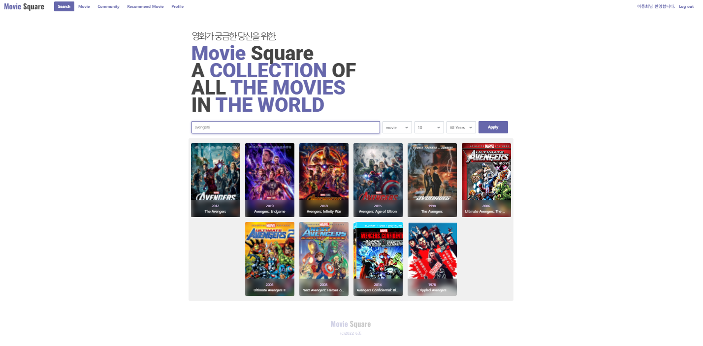

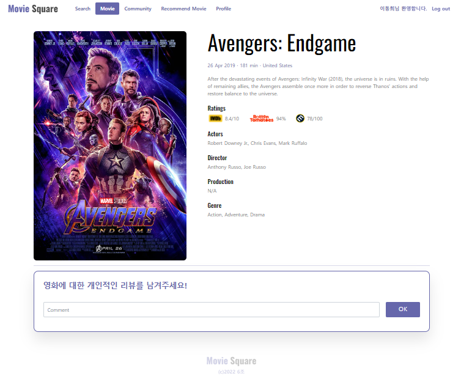

​		검색한 영화에 밑에 직접 댓글이나 리뷰를 작성할 수 있게 component를 만들어서 구성했습니다.

- [x] 추천 알고리즘을 통한 검색 후 검색된 영화와 관련된 추천영화 10개 제공

    

    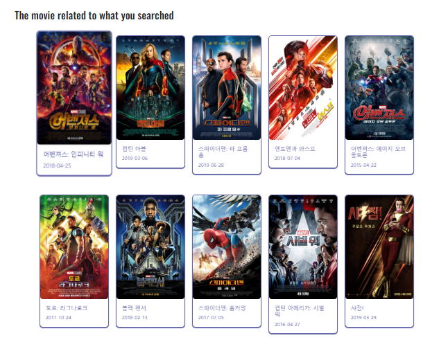

- avengers를 검색하고 난 후 나온 10개의 추천 영화입니다. 

- [x] 현재 상영중인 영화, 개봉중일 영화, 가장 평점이 좋은 영화 10개 제공

    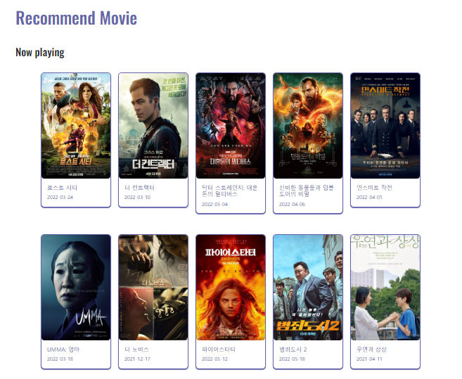

​	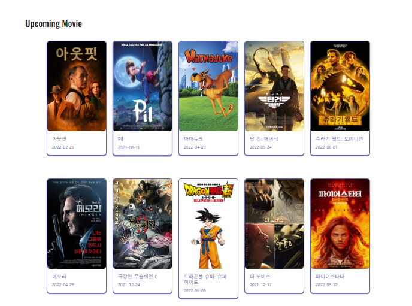

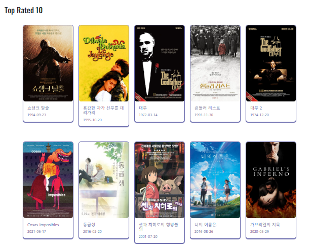

- [x] 게시글 CRUD가 가능한 커뮤니티 기능 구현 및 게시글 내에서 댓글 작성 수정 및 삭제 기능 구현

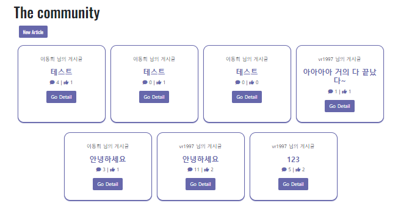

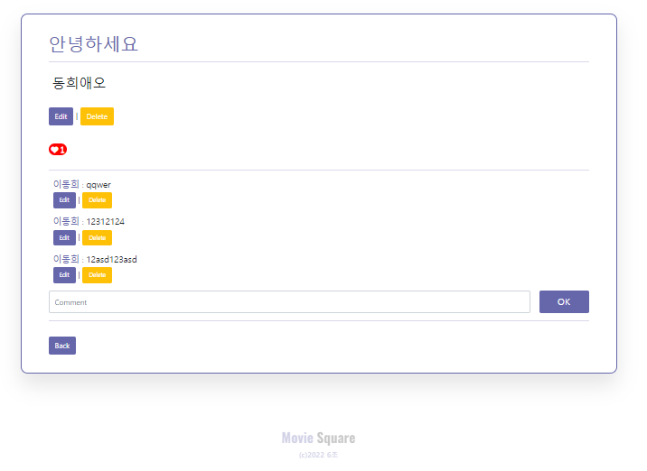

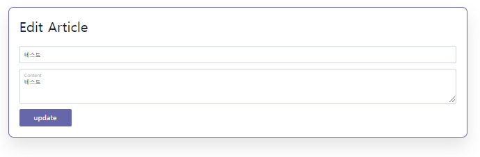

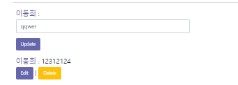

- [x] 작성한 글과 좋아요 한 글을 보여주는 프로필 페이지 구현

    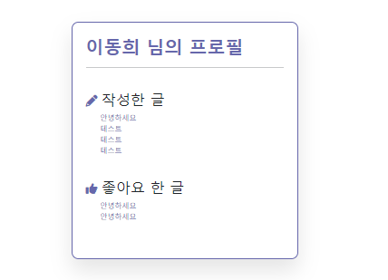

## 5) 기타 ( 느낀점 )

김태경 : 이번 프로젝트를 하면서 정말 많은 것을 느낄 수 있었습니다. 첫 번째로 앞서 한 pjt들과는 강도가 다르다는 점 이었습니다. pjt를 10번 하면서 웹페이지를 만들어서 학습이 많이 되었다고 생각했는데, 큰 오산이었습니다. pjt는 명세서가 있었고 명세서에는 우리가 프로젝트를 수행하기 위한 길이 정해져 있었고 큰 힌트를 주고 있었기 때문입니다. 명세서 없이 맨땅에서 시작하는 이번 마지막 프로젝트는 명세서 작성에도 큰 시간이 들었던 것 같습니다. 두 번째는 형식상 프론트와 백 엔드를 나누어 작업을 하였지만 결론적으로 프론트와 백에 대한 지식이 모두 프로젝트를 할 때 필요하다는 점 입니다. 나는 백을 할거니 프론트는 전혀 안봐도 되겠지 라는 생각을 하였지만 이 또한 오산이었습니다. 백을 만들때도 프론트를 봐야하고 반대 상황일 때도 마찬가지 였습니다. 프론트 그리고 백 둘다의 어느 정도의 숙련도가 꼭 필요하다는 것을 배웠습니다. 마지막은 페어 프로그래밍과는 또 달랐다는 점 입니다. pjt 때 페어 프로그래밍을 하였지만 긴 시간을 공유하지 않아서 그런지 이번 페어 프로그래밍과는 다른 느낌을 받았습니다. 일정 기간을 공유하면서 같이 프로그래밍을 하는것은 회사에 입사 하여 프로젝트를 만드는 것과 비슷한 환경을 경험해본 것 같습니다.

이동희 : 프론트 담당으로 첫 개발을 해보면서 vue.js를 메인으로 사용해 보게 되었는데 1학기동안 배운 것을 바탕으로 한 프로젝트에 엮으면서 결과물을 보는 과정이 너무나도 재밌었습니다. 물론 vue.js에서 서버에서 보내주는 데이터들을 옮기면서 화면에 뿌려주는 작업들이 아직 익숙치 않아서 많이 힘들고 당황스럽기도 했지만 직접 코드를 작성하면서 웹 어플리케이션을 개발하는 과정들이 꼬여있는 실을 풀어주는 역할을 해준 것 같아서 관통프로젝트 기간동안 더 성장한 것 같아서 기분이 좋았습니다.  필요한  API를 공식문서를 보면서 호출하는 것도 이제는 할 수 있게 된 것과 평소 즐겨했던 웹디자인을 바탕으로 이제는 직접 그것을 웹 어플리케이션으로 만들 수 있게 된 점에서 자신감이 많이 생긴 것 같습니다. 
